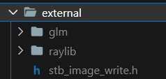

# Raytracing in c++

A very simple raytracer written in c++.
This project was inspired by
- [_Ray Tracing in One Weekend_](https://raytracing.github.io/books/RayTracingInOneWeekend.html)
- [_Ray tracing series by TheCherno_](https://www.youtube.com/playlist?list=PLlrATfBNZ98edc5GshdBtREv5asFW3yXl)


## Dependencies
- [raylib](https://www.raylib.com) easy to use graphics library
- [glm](https://github.com/g-truc/glm) mathematics library


## Getting started
1. Put all the dependencies in a directory called external, so that it looks something like this
    
    

2. From the project directory just run `make`
    ```cmd
    > make
    ```

3. That's it
