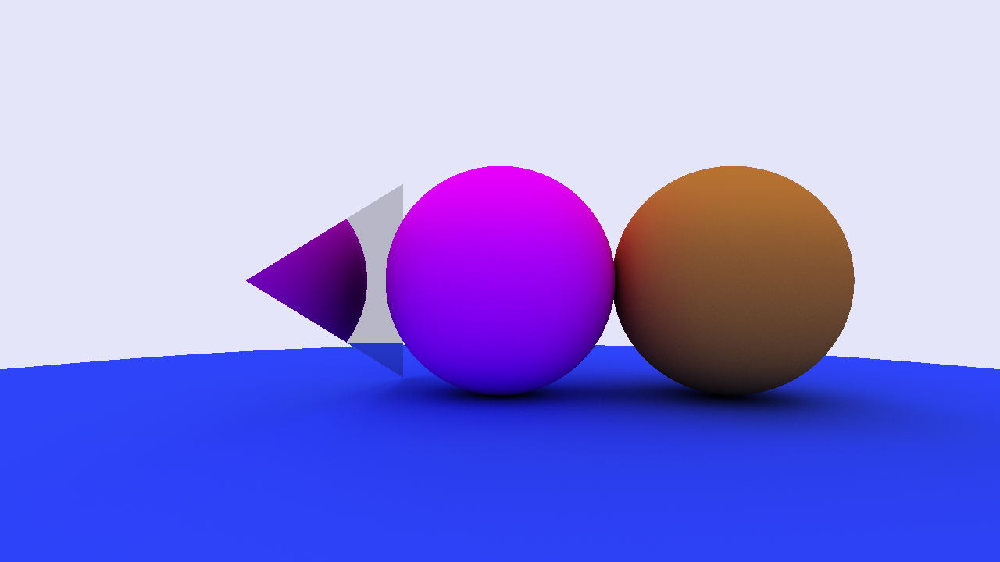
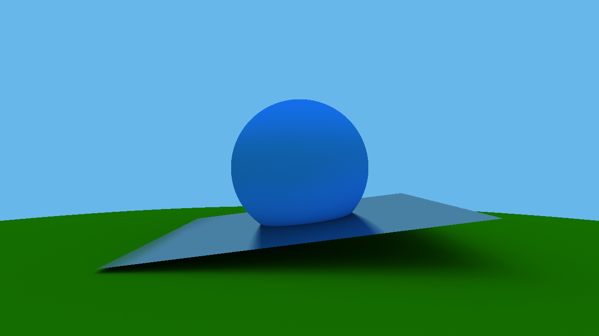

# Raytracing in c++

A very simple multi-threaded raytracer written in c++.
This project was inspired by
- [_Ray Tracing in One Weekend_](https://raytracing.github.io/books/RayTracingInOneWeekend.html)
- [_Ray tracing series by TheCherno_](https://www.youtube.com/playlist?list=PLlrATfBNZ98edc5GshdBtREv5asFW3yXl)


## Dependencies
- [raylib](https://www.raylib.com) easy to use graphics library
- [glm](https://github.com/g-truc/glm) mathematics library
- [stb_image_write.h](https://github.com/nothings/stb/blob/master/stb_image_write.h) saving pixels to disk


## Getting started
1. Put all the dependencies in a directory called external, so that it looks something like this
    
    

2. From the project directory just run `make`
    ```cmd
    > make
    ```

3. That's it

## Features and future plans
- [X] Exploring the scene
- [X] Add different types of geometries (spheres, triangles)
- [X] Different types of materials (lambertian, metal, emissive etc)
- [X] A standalone version for a single frame (outputs an image)
- [ ] Load scenes from json

---
#### Compiling without raylib
- Will output an image
- In terminal, add `STANDALONE=y` as arguments
    ```cmd
    > make STANDALONE=y
    ```

---
#### What you can do with the executable
- Move the camera using the standard wasd keys and use q,e keys to move in the 3d plane while holding right mouse button
- Switch between the (as of now 2) test scenes by pressing KEY_C + 1,2 etc (ofcourse you can create your own as well)

---
#### Materials
- Lambertian: always scatters the ray randomly
- Metal: reflects the ray perfectly (fuzz parameter provides the randomness)
- Emissive: acts like a light source

---
#### Screenshots



